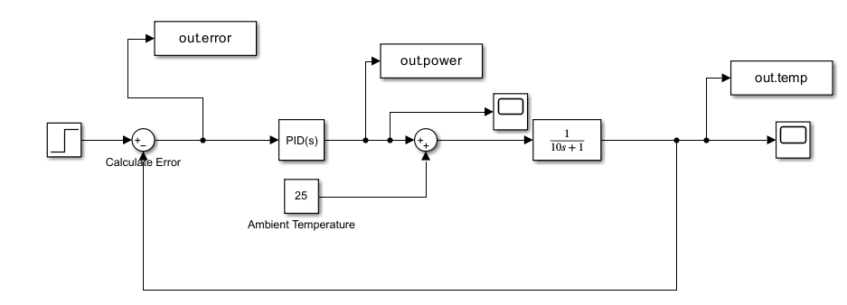

# 🤖 AI-based PID Controller (Project Not Completed Yet)

## 🎯 Objective
Design and optimize a PID controller using AI techniques for precise control of temperature in a Furnace.

## 🧠 Technologies Used
- MATLAB
- Simulink

## 📝You can find my Notes for the project in the notes/ folder

## 🖼️ Screenshots

## 🔮Future Scope
- Defining a Cost Function
- Use Bayesian OPtimization to find optimal PID Parameters
- Evaluate the AI optimized and Baseline PID 
