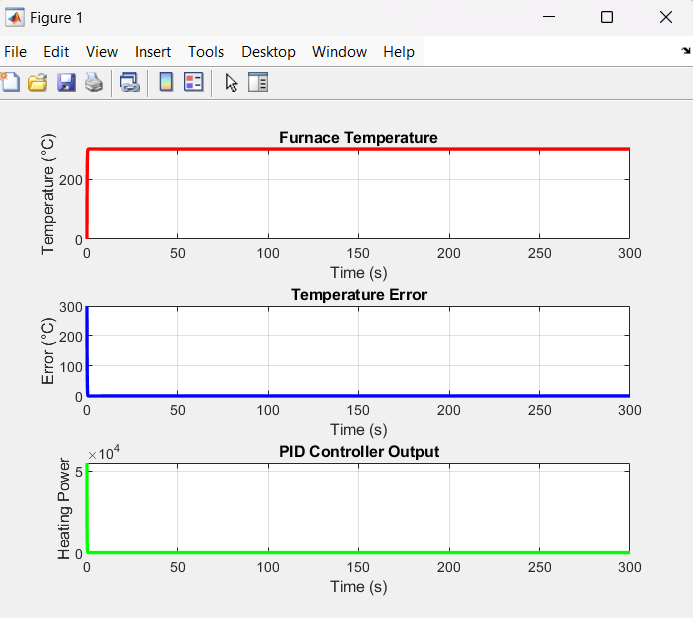

# 🤖 AI-based PID Controller 

## 🎯 Objective
Design and optimize a PID controller using AI techniques for precise control of temperature in a Furnace.

## 🧠 Technologies Used
- MATLAB
- Simulink

## 📝You can find my Notes for the project in the notes/ folder

## 🖼️ Screenshots

### PID Simulink Model

### A Baseline PID Controller Plot
**Output**
Settling Time: 29.83 seconds
Overshoot: 111.74°C
Steady-State Error: 0.00°C

### AI Based PID Controller Plot
**Output**
Settling Time: 0.40 seconds
Overshoot: 0.00°C
Steady-State Error: 0.00°C

## 🔮Future Scope
- Use Reinforcement Learning and Bayesian Optimization Algorithms
- Add Disturbance to the system and see how the algorithms respond
- Simulate Real Time data to Finalize the Project
