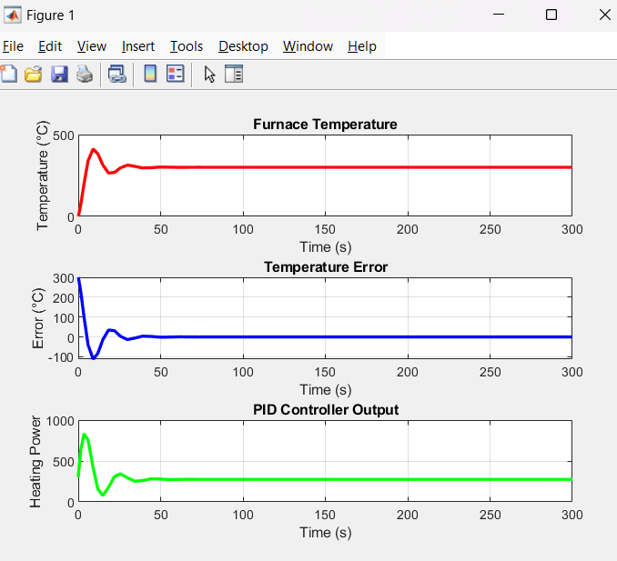

# 🤖 AI-based PID Controller (Project Not Completed Yet)

## 🎯 Objective
Design and optimize a PID controller using AI techniques for precise control of temperature in a Furnace.

## 🧠 Technologies Used
- MATLAB
- Simulink

## 📝You can find my Notes for the project in the notes/ folder

## 🖼️ Screenshots

### PID Simulink Model

### A Baseline PID Controller Plot
**Output**

Settling Time: 29.83 seconds

Overshoot: 111.74°C

Steady-State Error: 0.00°C

## 🔮Future Scope
- Defining a Cost Function
- Use Bayesian OPtimization to find optimal PID Parameters
- Evaluate the AI optimized and Baseline PID 
